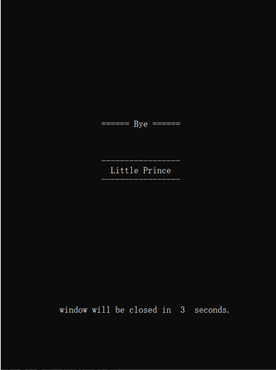

# Tetris

This is a simple Tetris game based on console in C++.

If you are interested in detailed design of the code, please refer to `Doc/Project Overview.md`

**Features**

- Complete game including starting page, scores evaluation and colorful cubes
- Support local High Score

**Screen Shots**

[Doc/Project Overview.md]: 